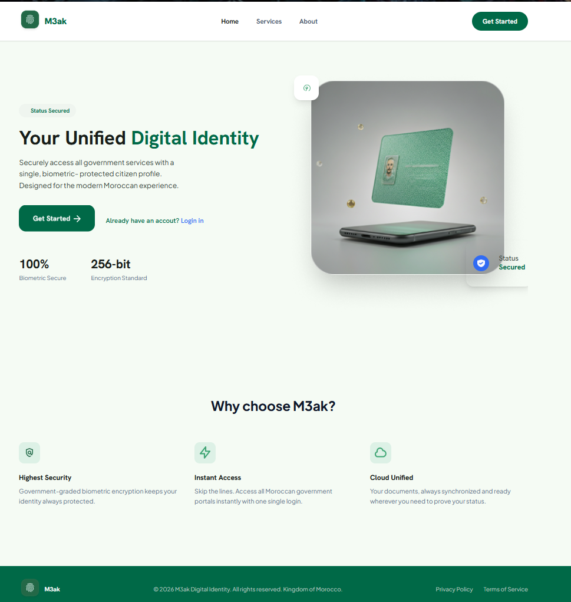

# 🇲🇦 Projet-M3AK

A modern digital identity platform for Morocco, currently under development.

## 📸 Preview



---

## 🚀 Tech Stack

- HTML5
- Tailwind CSS v4
- JavaScript

---

## 📋 Roadmap

- [x] Project Planning
- [x] UI/UX Design

- 🚧 Frontend Development
  - [x] Index Page
  - [ ] Landing Page
  - [ ] Sign In Page
  - [ ] Sign Up Page
  - [ ] Forgot Password Page
  - [ ] Reset Password Page
  - [ ] New Password Page
  - [ ] Home Page
  - [ ] Dashboard Page
  - [ ] Marketplace Page
  - [ ] User Profile Page
  - [ ] Transactions Page
  - [ ] Support Center Page
  - [ ] Digital Identity Page
  - [ ] Settings Page
  - [ ] Overview Page

- [ ] Responsive Design
- [ ] Testing
- [ ] Deployment

---

## 📂 Project Structure

```text
Projet-M3AK/
│
├── assets/
│   ├── images/
│   └── screenshots/
│       └── screen-index.png
│
├── pages/
│   └── overview.html
│
├── index.html
├── .gitignore
└── README.md
```