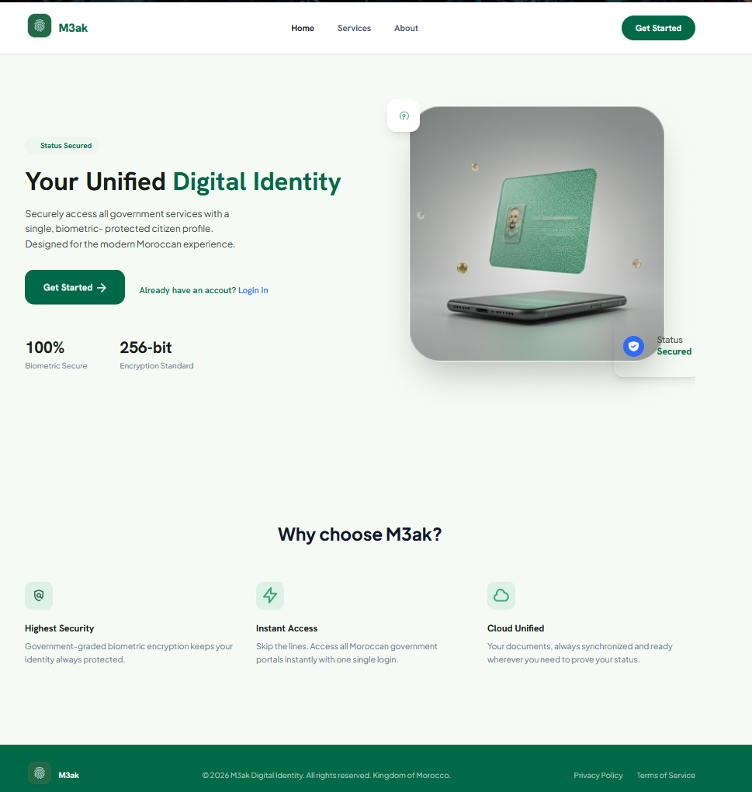
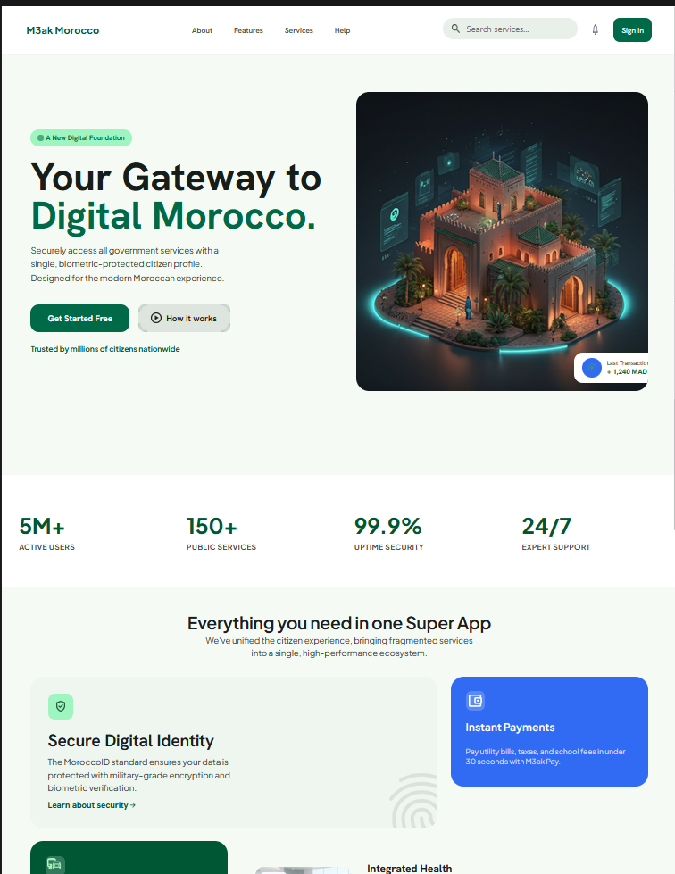

# 🇲🇦 Projet-M3AK

A modern digital identity platform concept for Morocco, currently under development as a **frontend prototype**. This project focuses on the interface, navigation, and user experience for managing digital identity and public services — the screens a citizen would eventually use, built and connected end-to-end on the client side.

---

## ⚠️ Current Development Scope

**Projet-M3AK is currently a frontend-only project.** Everything in this repository — the interfaces, responsive layouts, navigation, dark mode, client-side form validation, session handling, and interactive features (search, filters, the SOS flow, the wallet UI, etc.) — is implemented using HTML, Tailwind CSS, and vanilla JavaScript, running entirely in the browser.

| Layer | Status |
|---|---|
| **Frontend** (UI, layout, navigation, dark mode, client-side validation, interactivity) | ✅ Implemented |
| **Authentication** | ⚠️ Simulated client-side only, via `localStorage` (`session.js`) — not real authentication |
| **Backend / server** | ❌ Not implemented |
| **Database** | ❌ Not implemented |
| **Real API** | ❌ Not implemented |

Concretely, this means:

- "Signing in" or "creating an account" just writes a name/email to `localStorage` and unlocks the app pages — there is no server verifying credentials, and no account data is persisted anywhere but the visitor's own browser.
- Data shown across the app (transport times, marketplace listings, payment history, doctor listings, KPIs, etc.) is static/mock data defined in each page's own JavaScript, not fetched from any backend.
- There is no database, no server-side session, and no real API — every "request" (booking, payment, ticket submission) is a UI-only simulation (usually confirmed with a toast message) with nothing sent over the network.

None of this is hidden: the goal at this stage is a complete, well-connected frontend that a backend can be wired into later — not a finished product.

This is a deliberate, staged approach: the project is currently being built with HTML, Tailwind CSS, and vanilla
JavaScript only. Backend integration (real auth, database, API) is planned for a later phase, once backend
development is covered in the author's studies (2026/2027 academic year) — not something missing by oversight.

---

## 📸 Preview

<p align="center">
  
  
</p>

<p align="center">
  <b>Landing Page</b>
  &nbsp;&nbsp;&nbsp;&nbsp;&nbsp;&nbsp;&nbsp;&nbsp;&nbsp;&nbsp;&nbsp;&nbsp;&nbsp;&nbsp;&nbsp;&nbsp;&nbsp;&nbsp;&nbsp;&nbsp;
  <b>Overview Page</b>
</p>

> More screenshots (Marketplace, Emergency Hub, Admin Dashboard) coming soon — see [Known Issues](#-known-issues).

---

## 🚀 Tech Stack

- HTML5
- Tailwind CSS v4 *(via CDN — build step planned, see Roadmap)*
- JavaScript (vanilla, no framework)
- OpenStreetMap / Leaflet *(live maps & geolocation)*
- `localStorage` *(client-side only, for simulating the signed-in session — see "Current Development Scope" above)*

This is the complete stack. There is no backend framework, no database, and no server-side language involved at
this stage — no Node.js/Express, no Python/Django/Flask, no PHP, no SQL/NoSQL database, no REST or GraphQL API.

---

## 📂 Project Structure

```text
Projet-M3AK/
│
├── assets/
│   ├── icon-bar-left/          # Shared left-sidebar nav icons (+ "-green" active variants)
│   ├── transport-icon/         # Transport page icons (modes, planner, quick places)
│   ├── image-login/
│   ├── image-signUp/
│   ├── image-new-password/
│   ├── images/
│   ├── marketplace-image/
│   ├── emergence-image/
│   ├── health-image/
│   ├── support-image/
│   ├── suppor-assets/
│   ├── coming-soon/
│   ├── settings/
│   ├── dashboard-assets/
│   └── screenshots/
│
├── pages/
│   ├── auth/
│   │   ├── login.html
│   │   ├── signup.html
│   │   ├── forgot-password.html
│   │   └── reset-password.html
│   │
│   ├── app/
│   │   ├── overview.html         # "My Space" — merged personal portal (Overview / My Requests / Appointments / Personal Info / Account)
│   │   ├── service.html          # Services Directory (12 ministry categories + Marketplace as a bonus module)
│   │   ├── transport.html
│   │   ├── marketplace.html
│   │   ├── health.html
│   │   ├── emergence.html
│   │   ├── housing.html
│   │   ├── jobs.html
│   │   ├── education.html
│   │   ├── payments.html         # Wallet balance + bill payment categories
│   │   ├── registry.html         # Civil Registry (birth/marriage/residence certs)
│   │   ├── interior.html         # Passport, CNIE, residence permits
│   │   ├── finance.html          # Income tax, VAT, customs
│   │   ├── support.html          # Help Center (shared)
│   │   └── coming-soon.html      # Placeholder for not-yet-built sections
│   │
│   ├── admin-pages/
│   │   ├── dashboard.html        # Admin Dashboard — secondary/demo module (not in the citizen nav; reachable from the desktop footer + direct URL)
│   │   └── compte.html           # Redirect stub → overview.html ("My Space"); the old Account/Settings page, now merged in as tabs
│   │
│   └── js/
│       ├── session.js
│       ├── theme.js
│       ├── onboarding.js
│       ├── login.js
│       ├── signup.js
│       ├── forgot-password.js
│       ├── reset-password.js
│       └── emergence.js
│
├── index.html
├── .gitignore
└── README.md
```

---

## ✨ Features

- Modern and responsive UI, light/dark mode on every page (`theme.js`, shared across tabs)
- **Unified information architecture:** one main citizen journey — **My Space → Services → (Transport,
  Healthcare, Housing, Jobs, Education, Payments) → Emergency → Support**. The same left sidebar
  (My Space first, then the services, Emergency Support / Help Center / Settings / Logout in the foot)
  is now present and consistent on every app page, including the Emergency Hub.
- **My Space** (`overview.html`) — a single personal portal merging what used to be three overlapping
  pages (Overview dashboard + Compte Info + user settings). Tabbed: Overview, My Requests, Appointments,
  Personal Info (incl. Digital ID / CIN), Account (security + preferences). Deep links like
  `overview.html#account` or `#personal-info` open the matching tab; the old `compte.html#…` links
  still work via a redirect stub.
- Instagram-style collapsible sidebar on every app page: icons only by default, hovering the sidebar
  reveals every label at once, active page always visible on its own icon color
- Shared left-sidebar icon set: nav items use a single PNG set (`assets/icon-bar-left/`), with `-green`
  variants shown on the active page and a dark-mode filter that keeps the plain icons legible
- **Marketplace** and the **Admin Dashboard** are secondary modules, kept but out of the main journey:
  Marketplace is reachable as a "Bonus" card in the Services directory (and keeps its own page), the
  Admin Dashboard from a discreet "Admin dashboard (demo)" link in the desktop footer and by direct URL
- Live transport status on the My Space overview tab
- Digital identity management (UI) — CIN card, personal info, security, preferences in My Space → Personal Info / Account
- Public service directory (12 ministry categories: Housing, Jobs, Education, Healthcare, Registry, Interior,
  Finance, Justice, Foreign Affairs, Agriculture, Culture, Tourism — first 7 are real pages, the rest fall
  back to the shared Coming Soon placeholder)
- Marketplace with search, filters, sorting and wishlist *(product data is static/mock, no real checkout)*
- Payments hub UI with wallet balance, recent payments, and bill-payment categories *(mock data, no real
  transactions — nothing is actually charged or transferred)*
- Emergency Hub: hold-to-trigger SOS, quick dial (Police 19 / Ambulance 15 / Gendarmerie 177), live map, medical ID
  *(the SOS action is a UI simulation; no alert is actually sent to emergency services)*
- Admin Dashboard: KPIs, engagement trends, service usage *(all figures are static/mock data for the UI, not
  pulled from real usage)*
- Simulated session handling shared across pages via `localStorage` (`session.js`), with a client-side auth
  guard (`data-require-auth`) that redirects to Log in on every app/admin page if no session is stored — this
  is a frontend UX gate, not real authentication or authorization
- Clean and accessible design (ARIA attributes, keyboard-focus reveals sidebar labels too, descriptive
  `alt` text on every `` across the project)

---

## 📋 Roadmap

### ✅ Project Setup

- [x] Project Planning
- [x] UI/UX Design
- [x] Project Structure

### 🚧 Frontend Development

#### Authentication

- [x] Landing Page
- [x] Sign In Page (UI + validation, wired to session)
- [x] Sign Up Page (UI + validation, wired to session)
- [x] Forgot Password Page
- [x] New Password Page (live requirement checks + reset flow)

#### Dashboard / App

- [x] Overview Page
- [x] Services Page
- [x] Transport Page
- [x] Marketplace Page
- [x] Health / Find a Specialist Page
- [x] Emergency Hub Page
- [x] Admin Dashboard
- [x] Citizen Account / Settings Page (Personal Info, Digital ID, Security, Preferences)
- [x] Help Center Page (shared across the app)
- [x] Coming Soon placeholder (for sections without a dedicated page yet)
- [x] Housing Page
- [x] Jobs Page
- [x] Education Page
- [x] Payments Page (wallet balance + bill payment categories)
- [x] Civil Registry Page (birth/marriage/residence certificates, CNIE renewal)
- [x] Interior Page (passports, residence permits, CNIE)
- [x] Finance Page (income tax, VAT, customs)
- [ ] Justice, Foreign Affairs, Agriculture, Culture, Tourism pages (still on Coming Soon)

### 📱 Responsive Design

- [x] Mobile
- [x] Tablet *(falls back to the desktop/laptop layout — no dedicated tablet-specific breakpoint yet)*
- [x] Desktop

### 🧪 Testing

- [ ] Cross-browser Testing
- [ ] Automated broken-link check (GitHub Actions)
- [ ] Performance Optimization

### 🚀 Deployment

- [ ] Switch internal links to relative paths (required for GitHub Pages)
- [ ] GitHub Pages

### 🔧 Backend Development (Planned — 2026/2027)

- [ ] Real authentication (replacing the `localStorage` session simulation)
- [ ] Database
- [ ] Real API wired into the existing frontend

---

## 🐛 Known Issues

Tracking honestly so nothing is hidden behind a green checklist. The connectivity pass fixed the items below —
remaining items are genuinely open:

**Fixed:**

- ~~Three overlapping personal pages (Overview dashboard, `compte.html` "Compte Info", user settings) competed
  for the same job. Merged into one tabbed **My Space** (`overview.html`); `compte.html` is now a redirect
  stub. Marketplace and the Admin Dashboard were pulled out of the citizen sidebar/bottom-nav and kept as
  secondary modules. The left sidebar (with My Space first) is now identical across every app page,
  Emergency Hub included, and no link still points at the removed nav entries.~~
- ~~Internal navigation pointed at `/pages/dashboard/...` instead of `/pages/app/...`.~~
- ~~`login.js` called `window.M3akAuth`, but `session.js` exposed `window.M3ak`.~~
- ~~`reset-password.js` (formerly `new-password.js`) was empty and not loaded on `reset-password.html`.~~
- ~~`onboarding.js` redirected to `./pages/overview.htm` (wrong extension/path).~~
- ~~Inconsistent filenames (`service.html`/`services.html`, `emergence.html`/`emergency.html`).~~
- ~~`signup.html` had no JS attached.~~
- ~~No session guard — app pages were reachable without signing in, and no page cleared the session on logout.~~
- ~~`overview.html` and `marketplace.html` used `dark:` classes everywhere but never defined the dark color
  tokens or `@custom-variant dark` — dark mode toggled but barely changed anything visually.~~
- ~~`overview.html`'s inline script referenced a `#openMap` button that didn't exist, throwing on load and
  silently breaking Appointments/Payments rendering.~~
- ~~`marketplace.html`'s entire sidebar had unclosed `<a>` tags (missing `>` after `class="..."`), which
  likely broke the icon `` elements inside them.~~
- ~~`transport.html`'s Emergency Support button referenced a missing icon asset; `marketplace.html`'s used an
  unrelated icon; both now use a consistent alert-triangle icon like every other page.~~
- ~~`marketplace.html` had a redundant "Emergency" link in its nav list duplicating the "Emergency Support"
  button below it.~~
- ~~`reset-password.html` (formerly `new-password.html`) used a system-font fallback stack instead of the project's two fonts; `emergence.html`'s
  clock used `font-mono`. Project now uses only Plus Jakarta Sans / Hanken Grotesk throughout.~~
- ~~`health.html` had no sidebar and no way to open one on mobile (no hamburger button) — now matches every
  other app page.~~
- ~~Sidebar nav icons were re-declared as inline SVG on every page; they are now a single shared PNG set
  (`assets/icon-bar-left/`) with `-green` active variants and a dark-mode filter, and a Passport entry was
  added to every sidebar.~~
- ~~`transport.html`'s sidebar used an invalid Tailwind class (`dark:bg-accent-400/15/50`), so in dark mode
  it kept the pale light-mode background instead of `dark:bg-night-800` like every other page.~~
- ~~`transport.html` pointed its ~24 icons at a non-existent `/assets/transport/` folder (all 404). They are
  now wired to the exported `assets/transport-icon/` set; the mode buttons whiten the active icon via CSS
  instead of loading missing `-white` files.~~
- ~~`compte.html` (Account/Settings) had no mobile menu at all — the top nav was `hidden md:flex` with no
  fallback. It now has a hamburger + slide-in drawer like the rest of the app.~~
- ~~Many images across the project had empty `alt=""`; all now carry descriptive alt text.~~

**Still open:**

- Absolute paths (`/pages/...`) will 404 once deployed on GitHub Pages (served under a subpath) — needs a build
  step or relative-path rewrite before that deployment target.
- Justice, Foreign Affairs, Agriculture, Culture, and Tourism are represented by the shared Coming Soon
  placeholder, not real pages.
- `health.html` and admin `dashboard.html` still reference many `.png` icons from `assets/services-image/`
  and `assets/dashboard/` folders that don't exist — pre-existing gaps (`transport.html`'s equivalent gap is
  now fixed via `assets/transport-icon/`).
- Auth is frontend-only (`localStorage`), by design for this stage — no real backend/API yet.
- Tablet viewports render the same layout as desktop/laptop (the responsive design only really distinguishes
  mobile vs. desktop) — no breakpoint tuned specifically for tablet-sized screens.

---

## 📌 Current Progress

- ✅ Project setup completed
- ✅ Landing page completed
- ✅ Auth pages (login, signup, forgot password, new password) — UI complete, fully wired to the shared session
- ✅ Overview, Services, Transport, Marketplace, Health, Housing, Jobs, Education, Payments, Registry, Interior,
  Finance, Emergency Hub, Admin Dashboard, Account/Settings, Help Center — UI complete and cross-linked
- ✅ Internal navigation, auth JS, and session guard fixed across the app
- ✅ Dark mode verified complete on every page (two pages were silently broken, now fixed)
- ✅ Instagram-style collapsible sidebar rolled out to all 11 app pages that have one
- ✅ Sidebar nav switched to a shared PNG icon set (`icon-bar-left/`) with active-state green variants and a
  Passport entry on every page; `transport.html` wired to its own `transport-icon/` set
- ✅ Accessibility pass — descriptive `alt` text added to every image across the project
- ✅ Account/Settings page got the mobile hamburger + drawer it was missing
- ✅ Mobile, tablet, and desktop breakpoints in place across the app — tablet viewports currently reuse the
  desktop/laptop layout rather than a custom-tuned in-between design
- 🚧 Justice, Foreign Affairs, Agriculture, Culture, Tourism ministry pages (currently placeholders)
- 🚧 Cross-browser testing pending

---

## 👨‍💻 Author

**Hafid Karkouch**

- GitHub: https://github.com/hfdkr